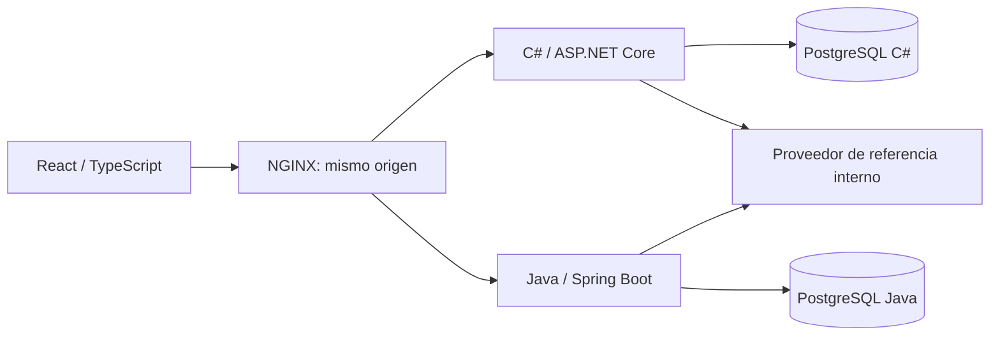

# Sentinel Procurement

[](https://github.com/jorgefprietol/sentinel-procurement-platform/actions/workflows/ci.yml)
[](https://github.com/jorgefprietol/sentinel-procurement-platform/actions/workflows/codeql.yml)

Plataforma de compras y aprobaciones con controles de seguridad de APIs, aislamiento entre organizaciones y auditoría transaccional. Dos servicios implementan el mismo contrato en **C# / ASP.NET Core 10** y **Java 21 / Spring Boot 4**, con una aplicación **React 19 + TypeScript** para operar ambos desde un único workspace.

El proyecto demuestra experiencia de implementación en backend, frontend, persistencia, seguridad aplicada y automatización DevSecOps. Su alcance y evidencia están documentados; no presupone un despliegue comercial ni una certificación de cumplimiento.

## Capacidades

- Solicitudes con importes en centavos y catálogo cerrado de proveedores.
- Perfiles de solicitud y aprobación con separación de responsabilidades.
- Visibilidad por organización y propietario, sin confianza en identificadores del cliente.
- Sesiones opacas de 30 minutos, cookies HttpOnly y revocación en PostgreSQL.
- Contratos de entrada estrictos, límites de consumo y protección de origen.
- Creación idempotente y cuota diaria protegidas por transacciones y bloqueos de filas.
- Aprobaciones concurrentes con una única decisión y un único evento de auditoría.
- Integración de proveedores con destino fijo y validación de respuesta no confiable.
- Contenedores sin privilegios y pipeline con pruebas, análisis y publicación de imágenes.

## Ejecutar

Requisitos: Docker con Compose v2 y Node.js 22.12 o superior. Los SDK se ejecutan dentro de los contenedores.

```sh
node scripts/bootstrap.mjs
docker compose up -d --build --wait --wait-timeout 240
```

Abre **http://localhost:18130**. La contraseña inicial está en `BOOTSTRAP_PASSWORD` dentro de `.env`; se genera aleatoriamente y se conserva entre ejecuciones. Nunca publiques ese archivo.

| Usuario local  | Organización | Perfil    |
| -------------- | ------------ | --------- |
| alice, bob     | north        | REQUESTER |
| carol          | south        | REQUESTER |
| approver       | north        | APPROVER  |
| south.approver | south        | APPROVER  |

Los usuarios son identidades de referencia para el entorno local. Cambiar `.env` después de inicializar los volúmenes no actualiza sus contraseñas almacenadas. Cada implementación usa una base de datos y una cookie diferentes. Usa el selector `.NET / Java` para elegir el servicio.

## Verificar

```sh
npm ci
npm run check:contract
npm run test:security
cd apps/web
npm ci
npm run build
npx playwright install chromium
npm run test:e2e
```

La suite de seguridad exige **volúmenes nuevos de este proyecto**: consume deliberadamente cuotas y frecuencias. No la ejecutes sobre datos que quieras conservar. Los resultados JSON y el informe de navegador se guardan en `artifacts/`, y el pipeline los adjunta a cada ejecución. Las pruebas de interfaz se ejecutan después de la suite de seguridad y usan `bob`.

Para detener y conservar los datos: `docker compose down`. Para reiniciar exclusivamente el entorno de referencia y borrar sus datos: `docker compose down -v`, seguido del comando de arranque.

## Arquitectura



Solo la interfaz expone un puerto, ligado a `127.0.0.1`. Las bases de datos y el proveedor no publican puertos. Las redes de datos e integración son internas. El usuario de aplicación de PostgreSQL no es superusuario y recibe permisos DML, sin permisos para crear tablas.

## Automatización

`ci.yml` valida OpenAPI, compila los servicios y la interfaz, ejecuta pruebas de seguridad e interfaz, busca secretos, analiza las cuatro imágenes con Trivy y genera SBOM. Las imágenes se publican en GHCR con etiqueta de commit y `latest` solo para `main`, después de superar las verificaciones. BuildKit adjunta procedencia y SBOM; no se incluyen secretos como argumentos de build.

`codeql.yml` analiza C#, Java y JavaScript/TypeScript. Dependabot propone actualizaciones de paquetes y acciones. Las acciones externas están fijadas por SHA. Los análisis de imagen conservan todos los hallazgos y bloquean vulnerabilidades HIGH/CRITICAL con corrección disponible; los hallazgos sin corrección siguen visibles en los informes.

## Documentación

- [Controles y evidencia OWASP](docs/security-controls.md)
- [Arquitectura y decisiones](docs/architecture.md)
- [Contrato OpenAPI](docs/openapi.yaml)
- [Operación y alcance de despliegue](docs/operations.md)
- [Experiencia técnica para portafolio](docs/experience.md)
- [Contribución](CONTRIBUTING.md) y [reporte de vulnerabilidades](SECURITY.md)

Referencia: [OWASP API Security Top 10 2023](https://api-security.owasp.org/editions/2023/en/0x11-t10/). Los controles se implementan y prueban en este repositorio; la referencia no constituye una certificación.
